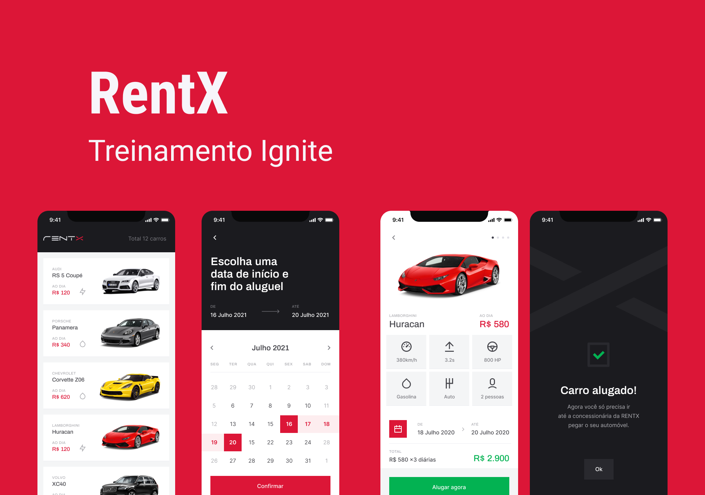

<h1 align="center">
   <br>
</h1>

<br>

<h1 align="center">
  
</h1>

<h1 align="center">
  
</h1>

## 💻 Projeto

Aplicação construída no 3º (terceiro) módulo do Ignite (Curso realizado pela [Rocketseat](https://rocketseat.com.br/)) na trilha de React Native.<br>

Esta aplicação realizar o agendamento de aluguéis de carros em um determinado dia ou período de dias.<br>

Este módulo teve como objetivo mostrar o consumo de api e trabalhar com animações no React Native.<br>

Como o objetivo não era criar a api, mas sim consumir, foi ultilizado o [json-server](https://github.com/typicode/json-server) na execução da api, no qual faz uso de uma api fake e simula uma api real, mas no ato de consumir a api, funciona de maneira nomal e semelhante a uma api verdadeira.


## 💬 Funcionalidades
```bash
 - Lista os carros disponíveis para aluguel
 - Mostra as iformações do carro
 - Mostra as imagens disponíveis do carro
 - Escolhe o periodo da data para aluguel
 - Mostra os carros agedados para aluguel pelo usuário
```

## 🎲 Executar aplicação
```bash
# Clone este repositório
$ git clone https://github.com/WillianMedeiros14/rentx.git

# Entre na pasta do projeto.
$ cd rentx

# Instale as dependências
$ yarn

# Execute a api
$ yarn api

# Em outra aba do seu terminal execute a aplicação
$ expo start

```

## 🚀 Tecnologias ultilizadas

- Este app foi criado com Bare Workflow, o qual possibilita criar aplicações **[React Native](https://reactnative.dev/)**, utilizando tanto as funcionalidades nativas do React Native como também as do **[Expo](https://docs.expo.io)**.